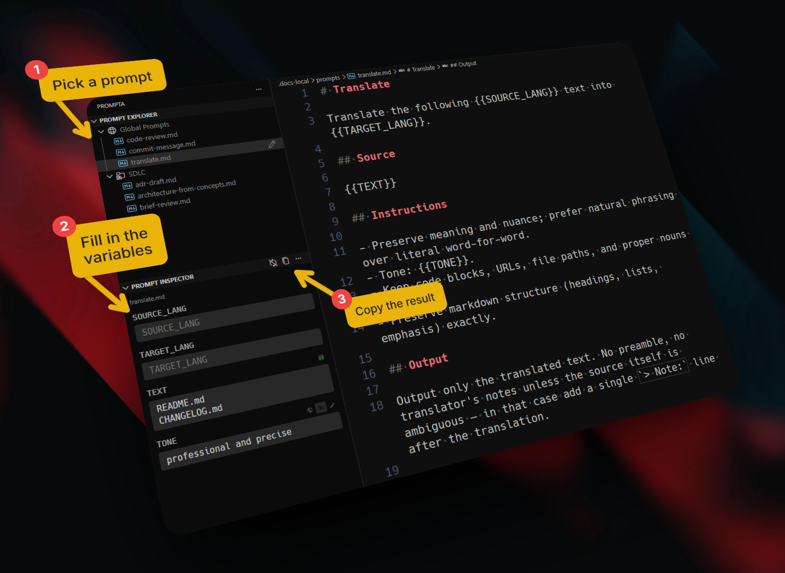

# Prompta

> Organize and compose AI prompts with reusable variables — right in VS Code.



## Features

- **Global & Project prompts** — a personal library (`~/Prompta/prompts`) and per-project prompts (`.prompta/` in workspace) in two dedicated trees
- **Native editor** — prompts open as regular text documents, so syntax highlighting, search, multi-cursor, Copilot, Git and every other VS Code feature just work
- **Prompt Inspector** — a side panel that auto-discovers `{{ variables }}` in the active prompt
- **Per-variable sources** — switch each variable between **Global**, **Project** or a one-off **Custom** value on the fly
- **Reusable values** — store variables in `prompta.env` files per scope, ready to reuse across prompts
- **Bulk actions** — switch all variables to a single source, or save all custom values to Global/Project in one click
- **Copy with Substitutions** — copy the prompt to clipboard with variables resolved
- **File management** — create, rename, delete, drag & drop inside both trees
- **Copy path / relative path** from the context menu

## Template Variables

Write prompts with placeholders:

```
You are a {{ ROLE }}.
Given the following context: {{ CONTEXT }}
Please {{ TASK }}.
```

Open the prompt and the **Prompt Inspector** lists every variable with three source buttons:

- **Global** — value from `<globalFolder>/prompta.env`
- **Project** — value from `<workspace>/<projectFolder>/prompta.env`
- **Custom** — a one-off value you type directly in the Inspector

Use the **Save** button next to a custom value to persist it to the Global or Project env file, or run _Save All to Global / Project_ to persist every custom value at once.

Run **Copy with Substitutions** to copy the prompt with all `{{ variables }}` resolved.

## Commands

| Command | Purpose |
|---|---|
| `Prompta: Copy with Substitutions` | Copy active prompt with variables replaced |
| `Prompta: Edit Global Variables` / `Edit Project Variables` | Open the corresponding `prompta.env` file |
| `Prompta: Reload Variables` | Re-read env files from disk |
| `Prompta: Switch All to Global` / `Project` / `Custom` | Bulk source switcher for the active prompt |
| `Prompta: Save All to Global` / `Save All to Project` | Persist all custom values at once |
| `Prompta: Set Global Prompts Folder` / `Set Project Prompts Folder` | Point Prompta at a different folder |
| `Prompta: Toggle Sidebar` | Show/hide the Prompta panel |

## Settings

| Setting | Default | Description |
|---|---|---|
| `prompta.globalFolder` | `~/Prompta/prompts` | Absolute path to the global prompts folder |
| `prompta.projectFolder` | `.prompta` | Relative path (from workspace root) to the project prompts folder |
| `prompta.fontSize` | `14` | Font size in the Prompt Inspector panel (px) |

## Getting Started

1. Install the extension
2. Click the **Prompta** icon in the activity bar
3. **Global Prompts** are ready to use — add your reusable prompts there
4. **Project Prompts** appear when you have a workspace open — great for project-specific prompts shared via git
5. Open any prompt and the **Prompt Inspector** below the trees will list its variables
6. Use `Prompta: Toggle Sidebar` from the command palette to quickly open the panel

## License

[MIT](LICENSE)
